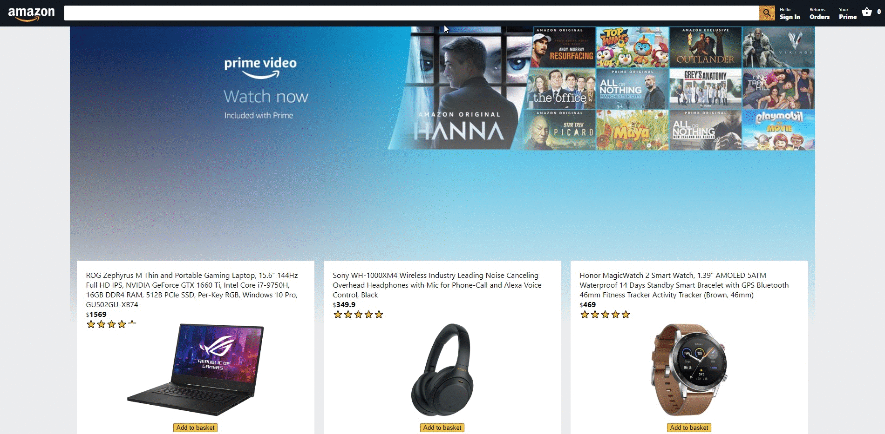

<!-- TABLE OF CONTENTS -->
## Table of Contents

* [About the Project](#about-the-project)  
* [Built With](#built-with)
* [Demo](#demo)

<!-- ABOUT THE PROJECT -->
## About The Project

[![Product Name Screen Shot][product-screenshot]](https://example.com)

This is an Amazon.com clone built with ReactJs and Firebase. It features User authentication, product listing page, checkout page, checkout subtotal calculator, etc.

#### **The live demo can be accessed at:**  [MyAmazon](https://example.com)

## Built With
ReactJs  
Firebase  
Firebase Auth  
React Context Api  
React Material UI  

<!-- Demo -->
## Demo

